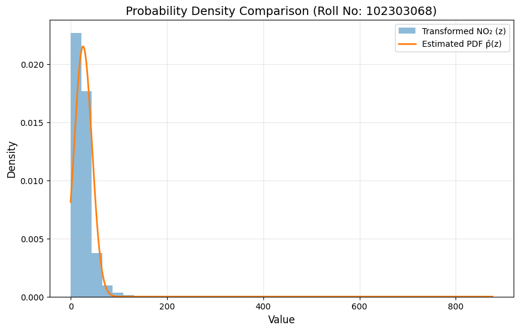

# Probability Density Function Estimation using NO₂ Data

## Objective
To model environmental NO₂ concentration data using a Gaussian Probability Density Function (PDF) after applying a roll-number-based non-linear transformation.

---

## Dataset
**India Air Quality Dataset (Kaggle)**  
https://www.kaggle.com/datasets/shrutibhargava94/india-air-quality-data  

Only the **NO₂ feature** is used as the input variable for probability density modeling.

---

## Methodology

### Step-1: Roll-Number-Based Non-Linear Transformation

Each NO₂ value **x** is transformed into **z** using:

**z = x + aᵣ · sin(bᵣ x)**

where:

- **aᵣ = 0.05 × (r mod 7)**  
- **bᵣ = 0.3 × ((r mod 5) + 1)**  
- **r** = university roll number  

This introduces a **controlled oscillatory variation** in the data distribution.

---

### Step-2: Gaussian PDF Modeling
The transformed variable **z** is modeled using:

**p̂(z) = c · exp(−λ (z − μ)²)**

Parameters estimated using **Maximum Likelihood Estimation (MLE)**:

- **μ** → Mean of transformed data  
- **λ** → Precision (inverse relation with variance)  
- **c** → Normalization constant ensuring total probability = 1  

---

## Results (Roll No: 102303068)

| Parameter | Value |
|-----------|-------|
| **μ** | 25.809622 |
| **λ** | 0.0014604 |
| **c** | 0.0215608 |

The learned Gaussian curve aligns closely with the transformed NO₂ distribution, confirming correct parameter estimation.

---

## Visualization

The following figure compares:

- Original NO₂ distribution  
- Transformed distribution **z**  
- Estimated Gaussian PDF  

---

## Repository Contents

- **Ass3.ipynb** → Complete Google Colab notebook  
- **README.md** → Project documentation  
- **graph.png** → Final visualization output  

---

## Conclusion
This experiment demonstrates how a **roll-number-parameterized non-linear transformation** influences probability density modeling of environmental sensor data.

The successful estimation of **μ, λ, and c** using **Maximum Likelihood Estimation** validates the Gaussian modeling approach for real-world NO₂ measurements.
